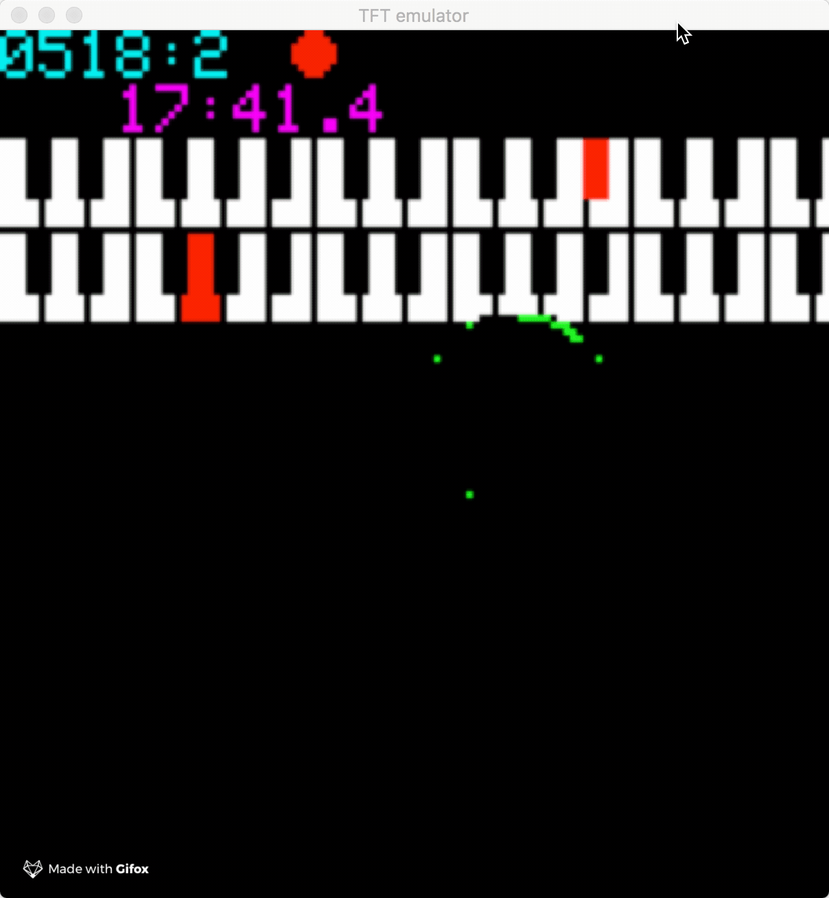

#  [](https://gitter.im/newdigate/teensy-midi-looper?utm_source=badge&utm_medium=badge&utm_campaign=pr-badge&utm_content=badge) [](https://travis-ci.org/newdigate/teensy-midi-looper)



## Microcontroller-based midi performance sequencer

### prototype device, iteration 1
* **record** midi events from a physical midi input port to standard midi files (SMF) on SD-card
* **play** smf files from SD-card to a physical midi output port
* **display** midi input & output activity, indicators (tempo, key, signature, position) on small color TFT display 
### hardware 
* ```Teensy 3.6 dev board```
  * ```32-bit 180 MHz ARM Cortex-M4 micro-controller```
  * ```sd-card built-in```
* ```1x Rotary encoder with built-in switch```
* ```ST7735 128x128 pixel 16bit color TFT LCD display```
* ```De-coupling midi break-out board```
  * hobbytronics [midi-breakout](http://www.hobbytronics.co.uk/midi-breakout "midi-breakout")
  * also works with BlackAddr Teensy Guitar Audio shield http://blackaddr.com/products/

[Teensy 3.6](https://www.pjrc.com/store/teensy36.html "Teensy 3.6") microcontroller board by **[pjrc.com](https://www.pjrc.com "pjrc.com")**  


### connections
```
// TFT
#define sclk 14  // SCLK can also use pin 13 (14 is compatibile with audio shield and teensy guitar audio shield
#define mosi 11  // MOSI can also use pin 7
#define cs   10  // CS & DC can use pins 2, 6, 9, 10, 15, 20, 21, 22, 23
#define dc   9   //  but certain pairs must NOT be used: 2+10, 6+9, 20+23, 21+22
#define rst  8   // RST can use any pin

// midi in/out (rx/tx)
#define midi_in_pin 1  // rx  
#define midi_out_pin 2 // tx

// rotary encoder
#define rotary_enc1   3   
#define rotary_enc2   4   
#define rotary_switch 5   
```


### Status
The project is a **work-in-progress** in a very **early** stage of development; I have working prototype using breadboard, as diagram above, records successfully to smf midi file on sd card which can be read from midi players and daws.

| Feature       | status | notes         |
| ------------- |-------------| -------------|
| Breadboard view | ```in progress``` | Using fritzing |
| PCB | ```not started```| |
| Enclosure | ```not started```| decide form factor | 

### Sketches
|        |  |          |
| ------------- |-------------| -------------|
| record midi to SMF on SD | ```works (needs attention)``` | compiles on:<ul><li>teensyduino</li><li>due</li><li>esp8266</li></ul> |
| read, play, loop SMF from SD | ```in progress``` |  |

### Software development
 * requirements
   * Arduino
   * Teensyduino
 * information about **compiling** and **debugging** software here: [software](Software)
