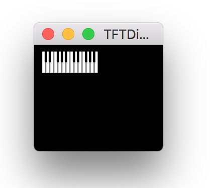

#  [](https://gitter.im/newdigate/teensy-midi-looper?utm_source=badge&utm_medium=badge&utm_campaign=pr-badge&utm_content=badge) [](https://travis-ci.org/newdigate/teensy-midi-looper)

## Teensy 3.6 32-bit ARM cortex M4 micro-controller
### prototype device and firmware
* **record** midi events from a physical midi input port to standard midi files (SMF) on SD-card
* **play** smf files from SD-card to a physical midi output port
* **display** midi input & output activity, indicators (tempo, key, signature, position) on small color TFT display 

This firmware is targeting [Teensy 3.6](https://www.pjrc.com/store/teensy36.html "Teensy 3.6") microcontroller board by **[pjrc.com](https://www.pjrc.com "pjrc.com")**  
  * features a 32-bit 180 MHz ARM Cortex-M4 processor
  * eco-system of source code libraries are available from arduino/teensy communities 


## Status
The project is a **work-in-progress** in a very **early** stage of development; I have working prototype using breadboard, as diagram above, records successfully to smf midi file on sd card which can be read from midi players and daws.

| Feature       | status | notes         |
| ------------- |-------------| -------------|
| Breadboard view | ```in progress``` | Using fritzing |
| PCB | ```not started```| |
| Enclosure | ```not started```| decide form factor | 

## Sketches
|        |  |          |
| ------------- |-------------| -------------|
| record midi to SMF on SD | ```works``` | compiles on:<ul><li>teensyduino</li><li>due</li><li>esp8266</li></ul> |


## Software development
 * requirements
   * Arduino
   * Teensyduino
 * information about **compiling** and **debugging** software here: [software](Software)



## Prototype hardware requirements / compatibity:
  * teensy 3.6 microcontroller board 
    * onboard SD Card using SDIO
    * https://www.pjrc.com/store/teensy36.html
  * Any Adafruit_GFX compatible tft should work theorerically,
    * Im using 2.2" Adafruit_ST7735 TFT 16-bit color display 160x160
  * rotary encoder with built-in switch
  * MIDI break-out board 
    * http://www.hobbytronics.co.uk/midi-breakout
    
more information about **hardware prototyping** and **pcb design** here: [hardware](Hardware)

## TFT display
  * indicators
    * displays notes received via midi on a piano keyboard view
    * song position (beats / bars)
    * indicates if SD card is missing
  * working on integrating with arduino menu
    * using rotary encoder and switch input

## Work in progress
  * recording (mostly working, tested lightly)
  * playback (not started)
  * looping
  * step record
  * multi-track loop recording
  * tempo detection
  * ILI9341 320x240 TFT color display integration
  * menu system

|                 |          |
| --------------- | ------------- |
| midi sequencing |               |
| TFT indicators |   |
|   * Piano view | ```basic``` | 
|   * recording indicators | ```blinking dot with filename ``` | 
| emulation on x86_64 | basic TFT emulation works, requires [JUCE](https://www.juce.com "JUCE libraries") |

## To-do
|                 |           |
| --------------- | ------------- |
| midi read from SMF  |   |
| midi looping |  |
 
## Why?
I'd like a portable battery-powered device with physical midi input and output port (5-pin DIN connector) which can play and record to/from SD-card. And I'd like it to display various indicators on a cheep 2" TFT display: tempo; song position; midi channel in/out activity; keyboard view; play/stop/recording;

Eventually I'd like looping/step-recording/multi-track sequencing and recording/tempo detection, quantization. A live midi peformance tool, basically. 
